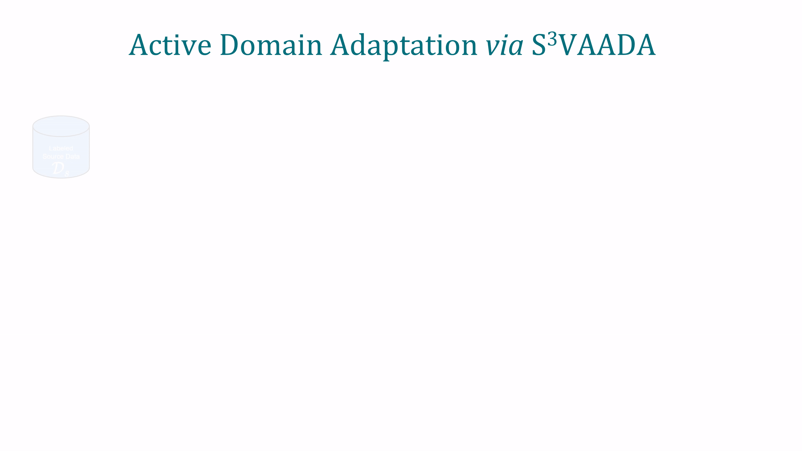

# S<sup>3</sup>VAADA: Submodular Subset Selection for Virtual Adversarial Active Domain Adaptation
## ICCV 2021
Harsh Rangwani, Arihant Jain*, Sumukh K Aithal*, R. Venkatesh Babu\
Video Analytics Lab, Indian Institute of Science, Bengaluru
## [[Project Webpage]](https://sites.google.com/iisc.ac.in/s3vaada-iccv2021/) [[Paper](https://arxiv.org/pdf/2109.08901v1.pdf)]

## Overview


## Setup the requirements
Run the following commands to setup your environment
```
git clone https://github.com/sumukhaithal6/s3vaada.git
cd s3vaada/
pip install -r requirements.txt
cd models/
wget https://download.pytorch.org/models/resnet50-19c8e357.pth
mv resnet50-19c8e357.pth resnet50.pth
cd ../
```

## Dataset
### Office-31
Run the following commands to download and preprocess Office-31 dataset
```
cd datasets/
sh get_office.sh
python preprocess_office31.py
cd ../
```
### Office-Home
Run the following commands to download and preprocess Office-31 dataset
```
cd datasets/
sh get_office-home.sh
python preprocess_office-home.py
cd ../
```

## Training
```
python main.py --name w2a-s3vaada --source webcam --target amazon
```

## Citation
If you'd like to cite our paper, use the following BibTeX entry.
```
@InProceedings{Rangwani_2021_ICCV,
    author    = {Rangwani, Harsh and Jain, Arihant and Aithal, Sumukh K and Babu, R. Venkatesh},
    title     = {S3VAADA: Submodular Subset Selection for Virtual Adversarial Active Domain Adaptation},
    booktitle = {Proceedings of the IEEE/CVF International Conference on Computer Vision (ICCV)},
    month     = {October},
    year      = {2021},
    pages     = {7516-7525}
}
```
